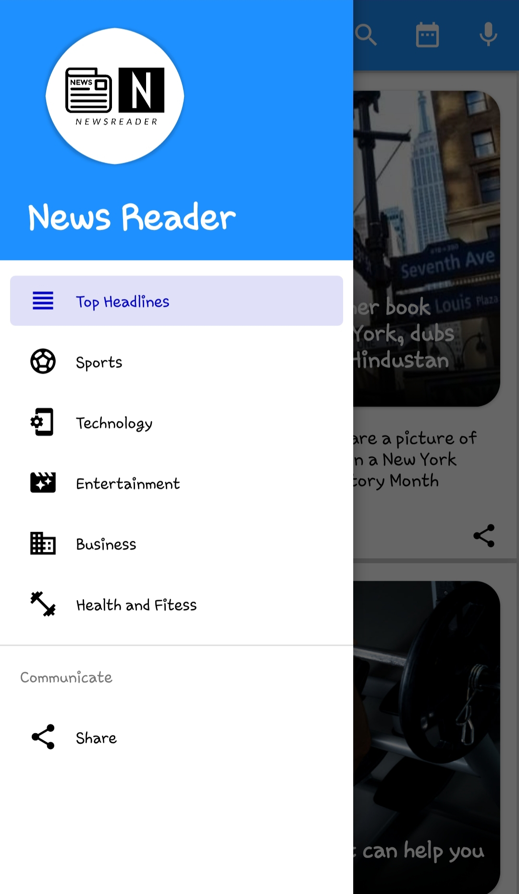

# News Reader
> News Reader app uses newsapi.org API to get news.

#### Note: To run the app you have to add [NewsAPI.org](https://newsapi.org/register) key. I have taken this step to due to limited access to daily request for News. Getting a key would take just few seconds :)

### Setup API Key
1. Visit [NewsAPI.org](https://newsapi.org/register) to get your API Key
2. Copy your API Key from accounts section and past it in ApiClient class
    ```
     public static final String API_KEY = "Your_Api_Key_here";
    ``` 
## Features
* Keyword Search
* Date wise search
* Voice search
* Category wise news

## Screenshots

- ##### navigation_drawer


- ##### technology


- ##### top_headlines


## Contact
Created by [@Neeraj Pandey](https://github.com/neerajp67/) - feel free to contact me!